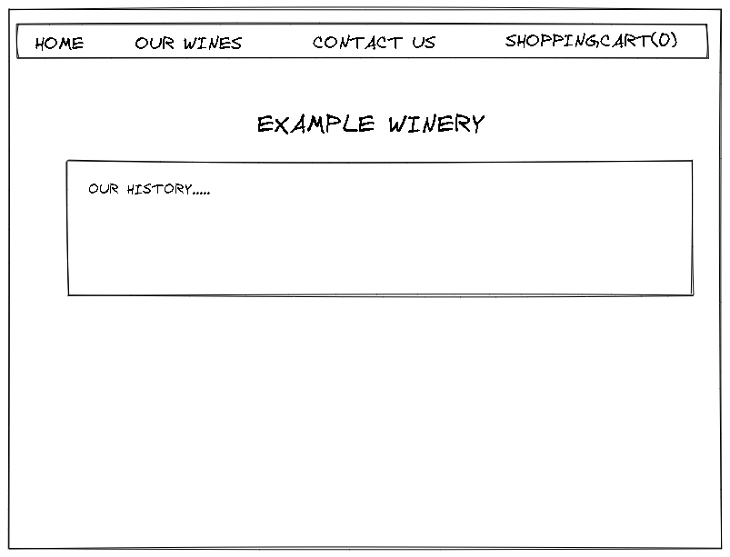
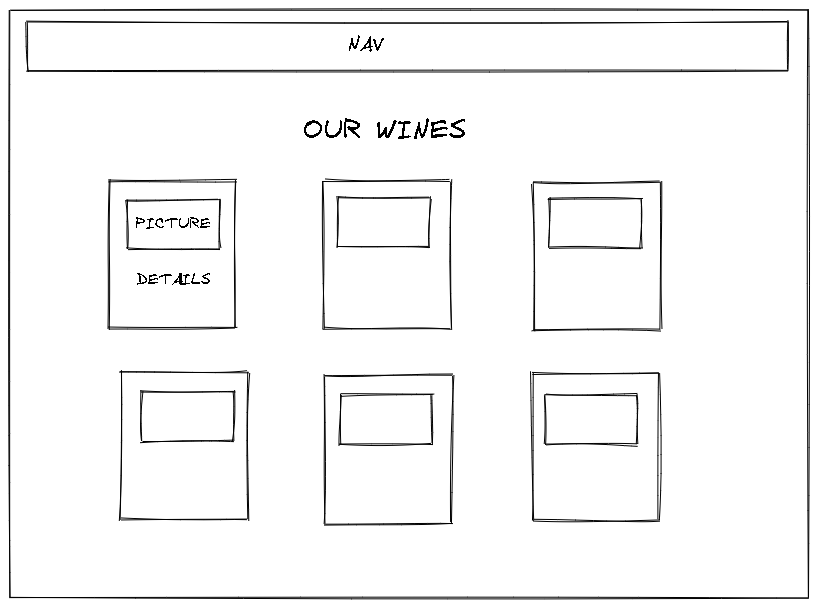
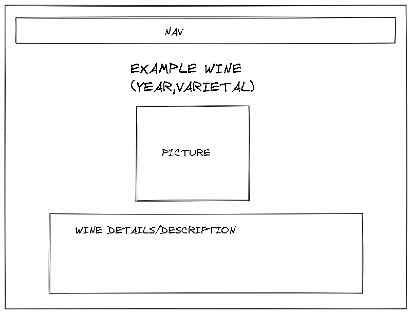
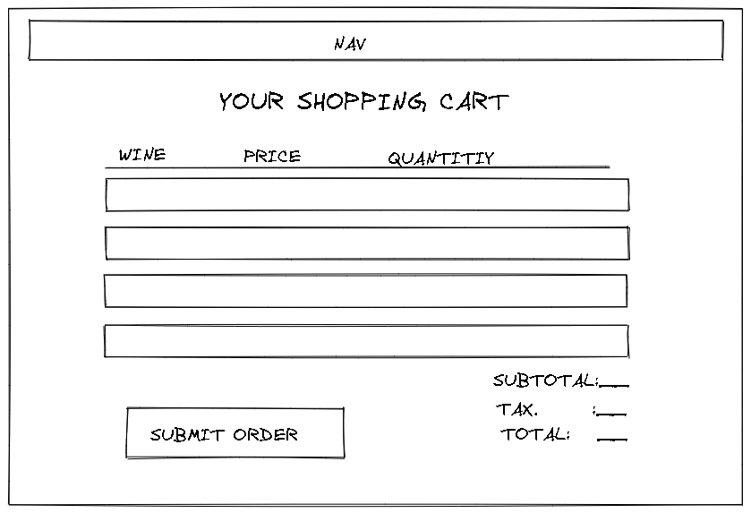
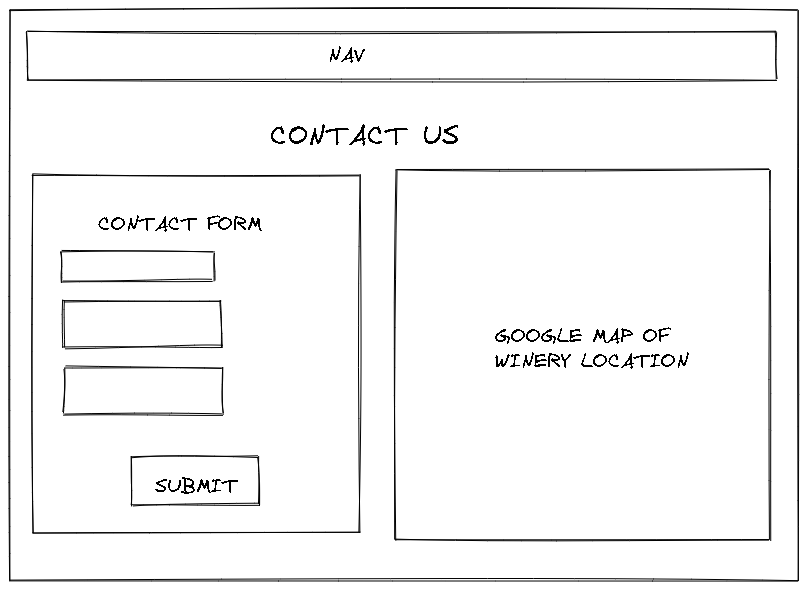

# Graphical Human Interface

## Landing Page

This is the main page that the user will 
see when they load the website. Includes
a navigation bar with links to other pages.

## Wine List

This is the page where the guest or registered member
can see the entire list of available wines. Includes
picture and important details.

## Wine Details

This is the page where the guest or registered member
can see the entire list of details for the specified wine.
Includes full description as well as other details.

## Shopping Cart

This is the page where the guest or registered can add 
specified wines to their cart and place an order. Includes
specified wine, price, and quantity. Subtotal, tax, and total
will be calculated.

## Contact Page 

This is the page where the guest or registered can contact
the winery for any and all inquiries. Includes a Google Maps
API for winery location.

